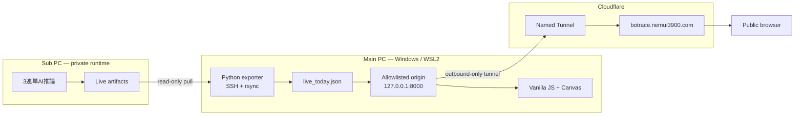

# BOTRACE — TRIFECTA ENGINE

実運用中のボートレース3連単AIを、データ収集から推論、意思決定、結果・収支までリアルタイムに可視化するポートフォリオです。

**Live:** [https://botrace.nemui3900.com](https://botrace.nemui3900.com)

> 静的な制作実績一覧ではなく、「現在動いているシステムそのもの」を見せるために作りました。

## What this demonstrates

- 複数PCに分散した実運用データの安全な収集と公開用変換
- 時系列データを扱う機械学習パイプラインの運用可視化
- 3連単120通りの確率、期待値、買い目、結果、収支の表現設計
- WSL2、SSH、rsync、systemd、Cloudflare Tunnelを組み合わせた自宅環境からのHTTPS公開
- Canvasによるリアルタイム描画と、ライブ更新中も動画を止めないフロントエンド最適化
- 公開範囲を最小化したread-onlyアーキテクチャ

## Highlights

### Live operations monitor

当日の開催スケジュールを読み込み、締切までの残り時間、推論中のレース、BET／見送り、確定結果、エンジン別・合算収支を表示します。ブラウザは公開用JSONを20秒ごとに取得し、元データは60秒周期で同期されます。

### Explainable inference view

艇ごとのTrueSkill、強度スコア、気象補正、3連単確率、EV分布など、推論artifactに記録された実数値を表示します。`p_final` は1着→2着→3着の艇色を使った3分割バーで、各帯幅は艇ごとの強度比を表します。

### Interactive map and telemetry

Natural Earth由来の海岸線から作った日本地図に24場を配置。Canvas上でstable-fluids系の流体表現、ビーコン、圧力場・速度場のENGINE VIEW、fpsテレメトリを描画します。

### Real pipeline, separated responsibilities

AI推論・投票系と公開サイトは別PC・別プロセスです。公開側はSSHでartifactをpullするだけで、実運用側への書き込み経路を持ちません。観測専用エンジンの疑似買い目も、実弾の賭金・収支・成績台帳には混ぜません。

## Architecture



データフロー：

```text
sub:/home/sub/stack2tan/data/live/<YYYYMMDD>
  → SSH / rsync
  → /tmp/botrace_live_cache/<YYYYMMDD>
  → tools/export_live_today.py
  → data/live_today.json
  → tools/serve_public.py
  → Cloudflare Named Tunnel
  → https://botrace.nemui3900.com
```

ネットワーク構成、WSL2とWindows Firewall、SSH逆トンネル、Named Tunnelまでの説明は、[公開基盤 技術レポート](docs/network-architecture.html)にまとめています。

## Technology choices

| Layer | Technology | Why |
|---|---|---|
| Frontend | HTML / CSS / Vanilla JavaScript | ゼロビルドで配布でき、可視化の仮説検証を高速に回せる |
| Graphics | Canvas 2D | 数千要素と毎フレーム描画をDOMから分離できる |
| Live transport | Fetch polling | 元データが分単位更新のため、WebSocketを持たず状態管理を単純化 |
| Exporter | Python 3 | JSON artifactの解析、暫定精算、公開スキーマへの変換 |
| Machine sync | SSH / rsync | 暗号化されたread-only pullと差分転送 |
| Process management | systemd | originとcloudflaredの常駐・自動再起動 |
| Public ingress | Cloudflare Named Tunnel | 受信ポートを開けず、固定ドメインでHTTPS公開 |

### Why JavaScript rather than TypeScript?

初期段階では、単一HTMLをブラウザで即座に試せることと、外部依存なしで配布できることを優先しました。現在はライブデータの型と画面状態が増えているため、次の保守フェーズではVite＋TypeScript、JSON Schema、コンポーネント分割への移行が合理的だと考えています。

## Public boundary

外部HTTP originはloopbackだけで待ち受け、次の3パスだけを返します。

```text
/
/index.html
/data/live_today.json
```

`/.git/*`、`/tools/*`、README、モデル、SSH鍵、生ログ、投票認証情報などは配信しません。公開用JSONも表示に必要な項目だけへ変換しています。

## Repository layout

```text
.
├── index.html                       # Single-page UI
├── data/
│   └── live_today.json              # Generated, gitignored
├── tools/
│   ├── export_live_today.py         # Private artifacts → public JSON
│   ├── live_sync_loop.sh            # 60-second synchronization loop
│   ├── serve_public.py              # Allowlisted read-only HTTP origin
│   ├── export_pipeline_trace.py     # Historical showcase trace exporter
│   └── make_coastline.py            # Natural Earth coastline generator
├── deploy/
│   └── boatrace-public.service      # systemd user unit
└── docs/
    └── network-architecture.html    # Interview-ready infrastructure report
```

## Run locally

Python 3以外の実行時依存はありません。

```bash
git clone https://github.com/nemui39/boatrace-atlas.git
cd boatrace-atlas
python3 tools/serve_public.py
```

ブラウザで [http://127.0.0.1:8000](http://127.0.0.1:8000) を開きます。

`data/live_today.json` がない環境ではライブフィードは表示されませんが、実ログから埋め込んだSHOWCASEと地図・Canvas表現は確認できます。ライブ同期には、このプロジェクト固有のSSHホストとprivate runtimeが別途必要です。

### Install the origin as a user service

```bash
systemctl --user link "$PWD/deploy/boatrace-public.service"
systemctl --user daemon-reload
systemctl --user enable --now boatrace-public.service
systemctl --user status boatrace-public.service --no-pager
```

## Validation

このリポジトリでは、変更時に最低限以下を確認します。

```bash
# Inline JavaScript syntax
node -e 'const s=require("fs").readFileSync("index.html","utf8"); new Function(s.match(/<script>([\s\S]*)<\/script>/)[1])'

# Python and shell syntax
python3 -m py_compile tools/*.py
bash -n tools/live_sync_loop.sh

# Origin allowlist
curl -I http://127.0.0.1:8000/
curl -I http://127.0.0.1:8000/data/live_today.json
curl -I http://127.0.0.1:8000/.git/config  # must be 404
```

## Scope and disclosure

- 現行ライブ運用の最終券種は3連単です。
- このリポジトリは可視化・公開adapterです。学習コード、モデル重み、特徴量定義、投票認証情報は含みません。
- 表示される確率・期待値・収支は、投資・賭博の利益を保証するものではありません。
- 公開サイトは自宅PC上のprivate runtimeに依存するため、メンテナンス中はライブデータが停止する場合があります。

## Status

- [x] 実データ同期と当日ライブ表示
- [x] 3連単AIの推論・EV・買い目・収支可視化
- [x] 観測専用エンジンと実弾成績の分離
- [x] SSH逆トンネルによるサブPC確認
- [x] Cloudflare Named Tunnel＋独自ドメイン
- [x] allowlist originとsystemd常駐
- [ ] 経歴・ケーススタディ・連絡先への導線
- [ ] OGP画像とSNS共有メタデータ
- [ ] TypeScript移行と自動テスト
- [ ] ライブ同期ループの永続サービス化と鮮度監視
